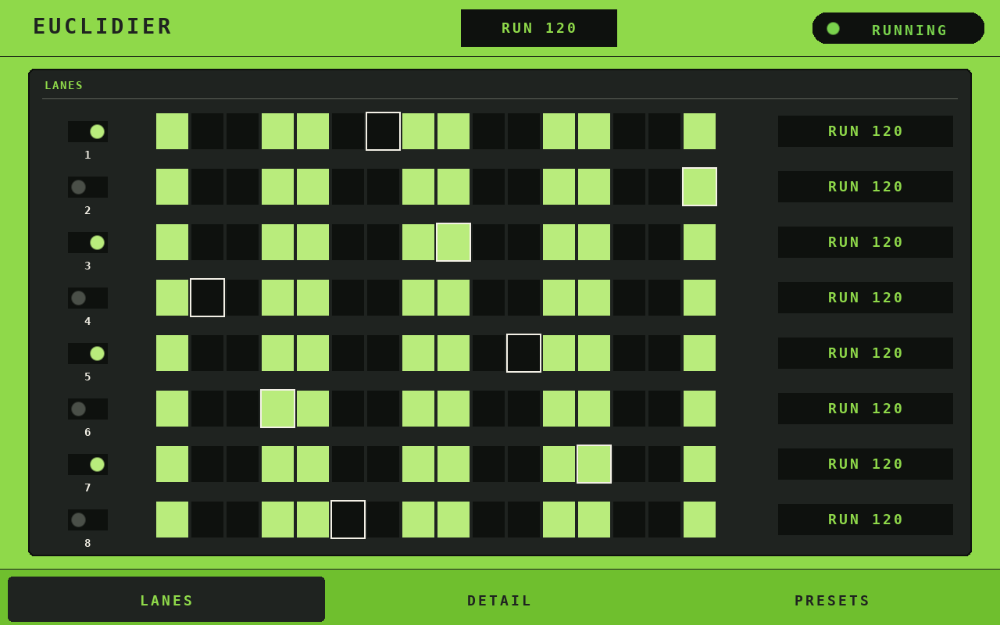
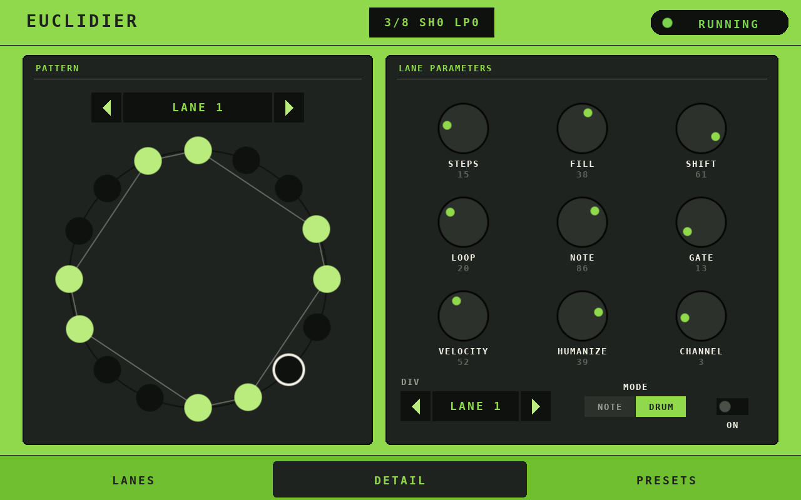
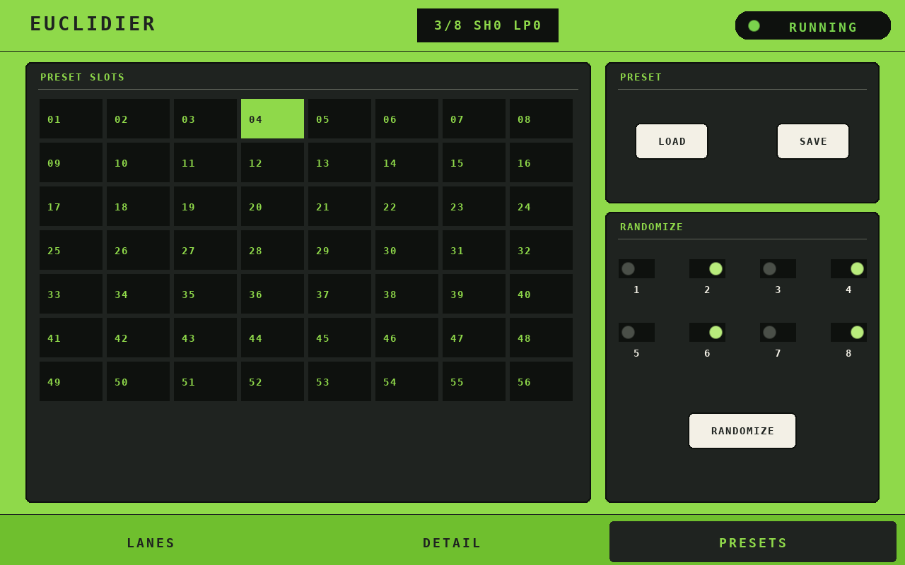

# Euclidier (Force Shadow Fork)

An 8-lane MIDI Euclidean note/CC sequencer for Akai Force / MPC, Raspberry Pi and macOS (Intel).

**This is a fork.** [intelliriffer/EUCLIDIER-CONSOLE](https://github.com/intelliriffer/EUCLIDIER-CONSOLE)
(by Amit Talwar) is the original, platform-agnostic sequencer controlled entirely over MIDI CC, with
no GUI. This fork, [sd88me/force-euclidier](https://github.com/sd88me/force-euclidier) (branch
`force-rework`), targets the Akai Force specifically: the engine was reworked so parameter edits
never need a transport stop/start, CPU use while playing dropped from ~5.3% to ~0.4%, and it adds a
Unix control socket plus a touchscreen "shadow mode" GUI page. The original MIDI CC interface is
unchanged and still works exactly as before — the fork is additive, not a replacement protocol. If
you just want the original cross-platform sequencer, use the upstream repo instead.

## What Euclidier does

Euclidier runs 8 independent sequencer lanes, each generating a
[Euclidean rhythm](http://cgm.cs.mcgill.ca/~godfried/publications/banff.pdf) — a pattern that spreads
a given number of "hits" (fill) as evenly as possible across a given number of steps, the same
algorithm behind a lot of traditional world rhythms (Cuban tresillo, Aksak meters, etc). Each lane has
its own step count, fill, shift (rotation), loop point, note/pitch, MIDI channel, gate length and
velocity, so you can layer 8 independent, phase-locked polyrhythms and send them out as notes, drum
hits or CC automation. It syncs to the Force's own transport clock, so it plays in time with whatever
else is running on the Force.

## Screenshots

The shadow-mode GUI page (Akai Force touchscreen, `SHIFT+SCENE-6`), three tabs:

| LANES | DETAIL | PRESETS |
|---|---|---|
|  |  |  |
| All 8 lanes at a glance | One lane's full parameter set | Preset bank + randomizer |

(Rendered with force-shadow's offline preview harness with sample data, not a live on-device capture.)

## Features

**Core (upstream):**
- 8 independent lanes, each with its own MIDI channel, note/pitch, Euclidean fill pattern, shift,
  loop point (polyrhythms via loop > steps), gate length, velocity + humanization, and time division.
- Note, drum, or CC track modes per lane (CC modes are MIDI-only in this fork — see below).
- 128 preset slots (save/load/program-change), with feedback to the controller on channel 16.
- Randomizer, internal or external clock, realtime note-triggered transpose/octave shift, velocity
  sense, chord-pad progression files.
- Runs on Akai Force/MPC, Raspberry Pi, or macOS (Intel).

**This fork adds:**
- **No resync needed.** Step position is derived from the transport's tick count, so editing
  steps/fill/shift/loop/division stays phase-locked to the beat — no more stopping and restarting
  playback after every tweak. Song Position Pointer and MIDI Continue are handled.
- **Much lower CPU.** Event-driven main loop instead of constant polling: ~5.3% → ~0.4% of one core
  while playing, ~0.2% → 0% idle.
- **Control socket** (`/tmp/euclidier_ctrl.sock` by default, `--ctrl-sock PATH`): a `GET`/`SET` text
  protocol used by the shadow GUI. Every `SET` runs through the exact same code path as the
  equivalent MIDI CC, so the two interfaces can never drift apart.
- **Shadow-mode touchscreen GUI** (needs [force-shadow](https://github.com/sd88me/force-shadow)):
  LANES (all 8 lanes, tap a step to toggle it, tap a row to select it), DETAIL (one lane's full
  parameter set), and PRESETS (one page of 56 slots + an 8-button multi-lane randomizer).

## Using Euclidier

### Shadow GUI (Akai Force)

Open the page with `SHIFT+SCENE-6`. Three tabs, plus a top-bar engine on/off pill and BPM readout:

- **LANES** — all 8 lanes as compact rows: enable toggle, step strip, and a live pattern readout.
  Tap a step cell to toggle it on/off directly (a manual override on top of the generated Euclidean
  pattern); tap anywhere else in a row to select that lane for the DETAIL tab. Manual step edits are
  overwritten the next time you change that lane's steps/fill/shift/loop/division — same as any
  Euclidean generator with manual overrides layered on top.
- **DETAIL** — the selected lane's full parameter set as a ring view plus knobs for
  steps/fill/shift/loop/note/gate/velocity/humanize/channel, a division stepper, and a NOTE/DRUM
  switch.
- **PRESETS** — one page of 56 preset slots (load/save), and a randomizer: tap any combination of the
  8 lane buttons, then RANDOMIZE. Leave none selected to randomize all 8 lanes at once.

**Known limits:** the PRESETS list only shows slots 1–56 of the full 128-slot bank (one screen's
worth); reach slots 57–128 over MIDI (CC 20 select, CC 29 load, CC 30 save, or Program Change).
CC track modes (3/4) and the internal clock still exist in the engine but aren't reachable from the
GUI or the control socket — set them over MIDI CC if you need them (see the CC map below).

### MIDI CC control (any platform)

Works identically to upstream, with or without the shadow GUI. A Force MIDI track template (the
`.xtk` file in this repo's root) is included with all parameters named and mapped:

1. Load the provided track template in Force.
2. Set its MIDI output to "Mockba Euclidier" (or whatever port name your build exposes), output
   channel to 16 (feedback channel; all input channels work).
3. Create instrument track(s), set their input to the Euclidier MIDI port, input channel to the lane's
   configured output channel (1 by default).
4. Start playback on the Force — lane 1 should start playing. Repeat for other lanes via the
   Euclidier control track (SHIFT + CLIP to edit settings), or use the shadow GUI instead.
5. For drum lanes (5–8 by default): load a drum kit, set its input to the Euclidier port, input
   channel to 10, and monitoring to "in" or "merge". On the control track, enable channels 5–8
   (pages 3–4; channel 5 = kick).

#### Full MIDI CC map

| CC(s) | Lanes 1–8 | Meaning |
|---|---|---|
| 1,11,21,…,71 | ✓ | Enable lane (value > 63 = on) |
| 2,12,22,…,72 | ✓ | Note/pitch (0–127) |
| 3,13,23,…,73 | ✓ | Time division — see table below |
| 4,14,24,…,69,74 | ✓ | Steps (2–64) |
| 5,15,25,…,75 | ✓ | Fill/pulses (1–64); fill ≥ steps fills every step |
| 6,16,26,…,76 | ✓ | Shift/rotation (0–64), wraps around |
| 9,17,27,…,77 | ✓ | Gate length, 10–95% (default 65%) |
| 8,18,28,…,78 | ✓ | Output MIDI channel (1–15; 16 is reserved for feedback) |
| 81–88 | ✓ | Base value (velocity, or CC base value), default 96 |
| 91–98 | ✓ | Value-alt: note mode = humanize range (0–50) added to base velocity; CC mode 1 = second CC value sent after gate; CC mode 2 = random value between base and alt |
| 101–108 | ✓ | Loop point (0 = off; < steps shortens the pattern; > steps creates a polyrhythm) |
| 111–118 | ✓ | Track mode: 1 = note, 2 = drum, 3/4 = CC (dormant/MIDI-only in the shadow GUI) |

Time divisions (CC 3,13,…,73 and the DETAIL tab's DIV stepper), value → label:

| Value | 0 | 1 | 2 | 3 | 4 | 5 | 6 | 7 | 8 | 9 | 10 |
|---|---|---|---|---|---|---|---|---|---|---|---|
| Label | 1/16 | 1/16 | 1/8 | 1/4 | 1/2 | 1 | 1/32 | 1/24 | 1/12 | 1/6 | 1/3 |

(Values 7–10 are triplet-style divisions, not the "dotted" values the original CC-value ordering might
suggest — this matches the engine's actual `getDiv()` table.)

**Global CCs:**

| CC | Meaning |
|---|---|
| 20 | Select preset slot (0–127) |
| 29 | Load from selected preset slot |
| 30 | Save to selected preset slot |
| Program Change | Load from preset slot 0–127 |
| 50 | Master-sync quantize (0–8 bars) — quantizes parameter edits to the clock; edits apply immediately when this is 0 (the fork's new default) |
| 70 | Sync all tracks (resets internal step position to 0) |
| 89 | Randomize lane select: 0 = all, 1–8 = one lane, 9 = all but lane 1, 10 = all but lane 5 |
| 90 | Randomize go (fires on any even value > 0) |
| 99 | Receive notes (0/1) |
| 100 | Reset all transpose/octave offsets (any positive value) |
| 119 | Velocity-sense octave switching (0/1) |
| 59 | Use external clock (0/1); internal clock is the fallback when off |
| 60 | Start/stop internal clock (0/1) |
| 80 | Alternate internal-clock start/stop (0/1) |
| 39, 40 | Internal clock BPM1 + BPM2 (actual BPM = BPM1 + BPM2, e.g. 100 + 40 = 140) |

**Realtime note input** (when receive-notes is on):

| Notes | Meaning |
|---|---|
| 0–11, 12–23, …, 84–95 | Transpose lane 1, 2, …, 8 by +0–11 semitones |
| 96–103 | Reset octave shift on lanes 1–8 respectively |
| 108–115 | +1 octave shift on lanes 1–8 respectively |
| 120–127 | −1 octave shift on lanes 1–8 respectively |

### Tips

**Polyrhythm (e.g. 3-against-4):** Lane 1 = 4 steps / 1 fill, Lane 2 = 3 steps / 1 fill. Multiply both
step counts for longer patterns, and try a loop point a few steps past the total for variation.

**Accents via CC:** create a lane in CC mode 3, set note to 11 (expression), base value ~90, value-alt
127, and assign it to the same channel as the instrument you want to accent.

## Requirements

- **Akai Force or MPC** with SSH access via a firmware mod (e.g. MockbaMod), for GUI use and for
  building/deploying on-device.
- **[force-shadow](https://github.com/sd88me/force-shadow)** add-on installed, only if you want the
  touchscreen GUI — the engine and MIDI CC interface work standalone without it.
- Otherwise: a Raspberry Pi or macOS (Intel) with ALSA/CoreMIDI, no GUI, MIDI CC only.

## Installation

### Akai Force / MPC (MockbaMod)

1. Build (see below) or download a prebuilt `euclidier` binary for armhf.
2. Copy `euclidier`, `addon/NSMODULE.json`, and (if using the GUI) `addon/shadow_page.conf` into
   `AddOns/Euclidier/` on the device.
3. Launch via MockbaMod's nodeServer web UI, or bind a launch script/combo to run
   `AddOns/Euclidier/euclidier -v --ctrl-sock /tmp/euclidier_ctrl.sock`.
4. For the shadow GUI: install force-shadow separately, then open the page with `SHIFT+SCENE-6`.

### Raspberry Pi / macOS (standalone, MIDI CC only)

1. Build with `compile_pi.sh` (Raspberry Pi) or `compile_mac.sh` (macOS, Intel).
2. Run the resulting binary over SSH or in a terminal — it creates two virtual MIDI ports
   ("Euclidier") for input/output.
3. Build your own MIDI control surface against the CC map above, or adapt the Force track template.

## Building from source

- **Force/MPC (armhf):** `build/build.sh [outname]` — builds in a Docker container (`linux/arm/v7`,
  QEMU-emulated), output in `bin/`. First run builds the Docker image, which is slow; subsequent runs
  reuse it.
- **Raspberry Pi / macOS:** `compile_pi.sh` / `compile_mac.sh` (g++ with ALSA/CoreMIDI support).
- **Shadow GUI widget** (force-shadow's `euclid` widget) and the generated `addon/shadow_page.conf`
  (via `scripts/gen_shadow_page.py`) are built and tested in the
  [force-shadow](https://github.com/sd88me/force-shadow) repo — see its own README for the widget
  build steps and the offline render harness used for the screenshots above.

## Project layout

```
euclidier.cpp, eqseq.cpp/.h, bjlund.cpp/.h   Engine: control socket, sequencer state, Euclidean generator
RtMidi.cpp/.h, RtError.h                     Cross-platform MIDI I/O (RtMidi)
build/build.sh                               Force (armhf) Docker build
compile_pi.sh, compile_mac.sh                Raspberry Pi / macOS build scripts
addon/NSMODULE.json                          MockbaMod add-on manifest (process name, launch args)
addon/shadow_page.conf                       Generated shadow GUI page (do not hand-edit)
scripts/gen_shadow_page.py                   Generates addon/shadow_page.conf
docs/screenshots/                            GUI preview renders used in this README
Euclidier Progressions/                      Chord-pad progression files
euclidierBANK.bin                            Default 128-slot preset bank
DESIGN.md                                    Architecture notes for the Force rework (engine, socket, GUI)
```

## Related projects & Credits

- Upstream: [intelliriffer/EUCLIDIER-CONSOLE](https://github.com/intelliriffer/EUCLIDIER-CONSOLE) by
  Amit Talwar ([intelliriffer](https://github.com/intelliriffer)) — the original sequencer this fork
  is built on.
- [force-shadow](https://github.com/sd88me/force-shadow) (sd88me) — the touchscreen shadow-mode
  renderer this fork's GUI page runs on.
- Runs under MockbaMod firmware modifications for Akai Force/MPC.
- Fork and Force-specific rework: [sd88me](https://github.com/sd88me).

## License

No license file is present in the upstream repository; this fork has not added one. Treat this code
as all-rights-reserved pending clarification from the upstream author.
